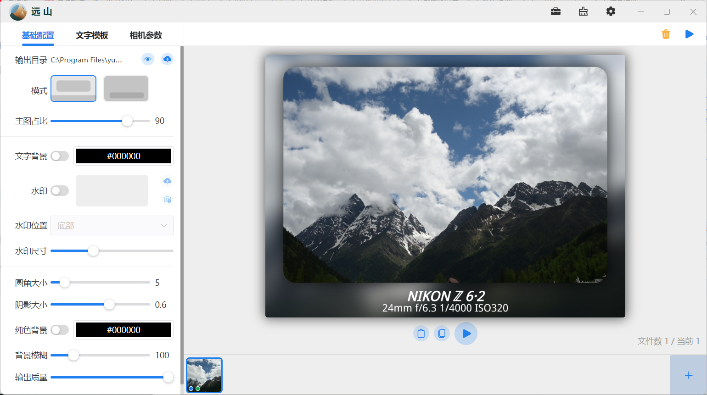
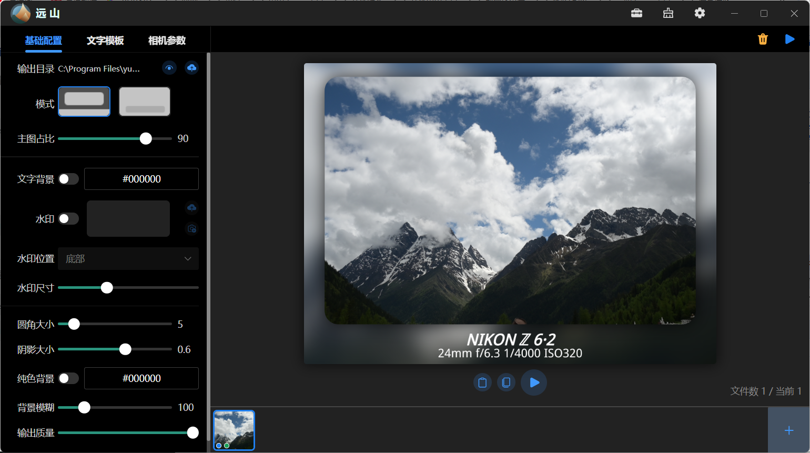
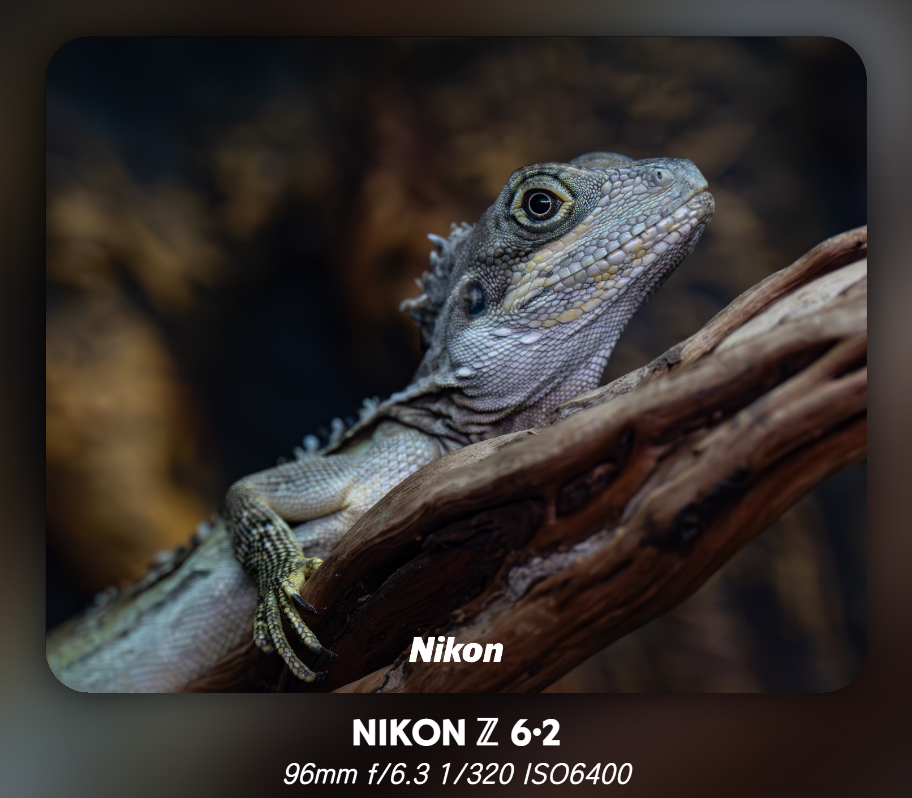
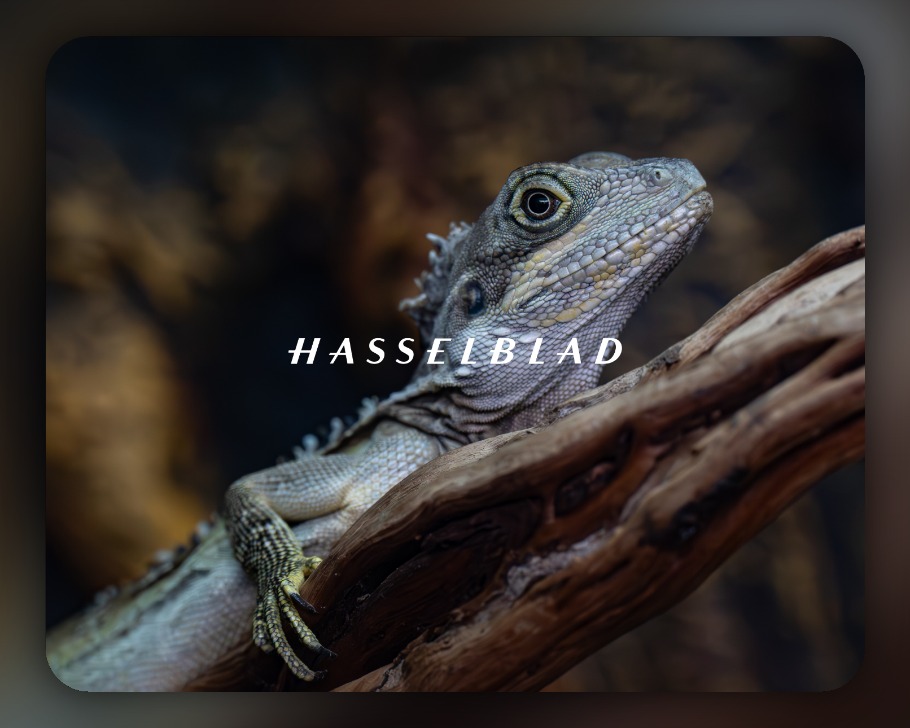
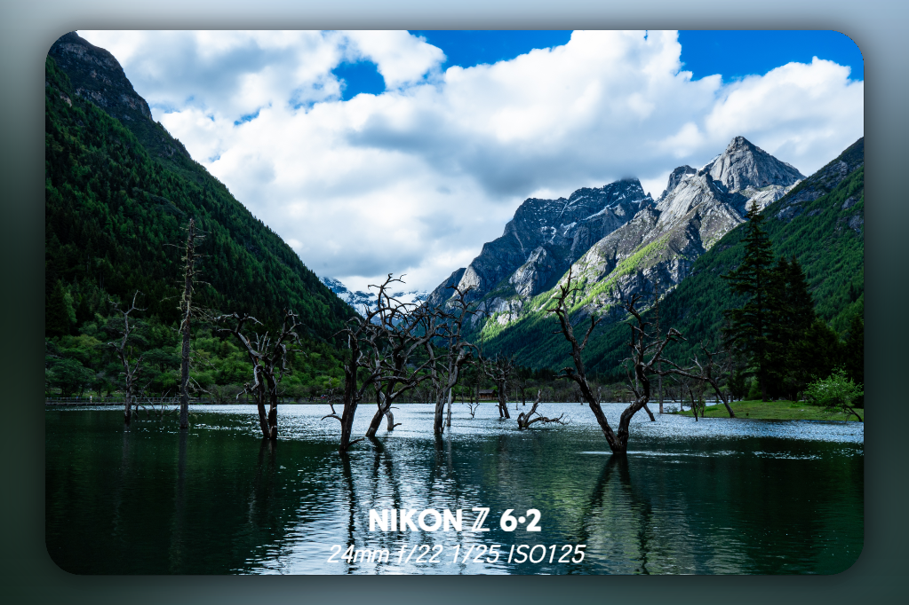
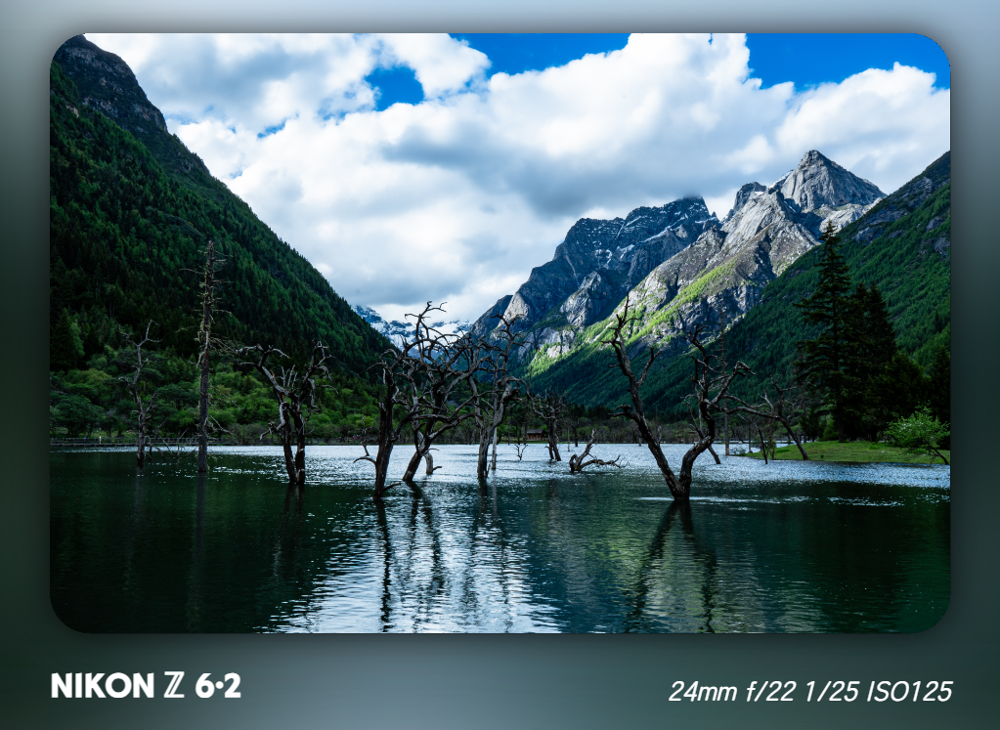
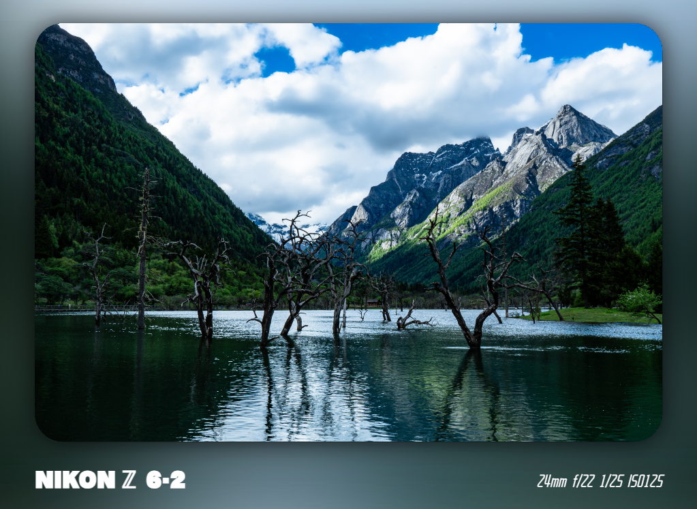
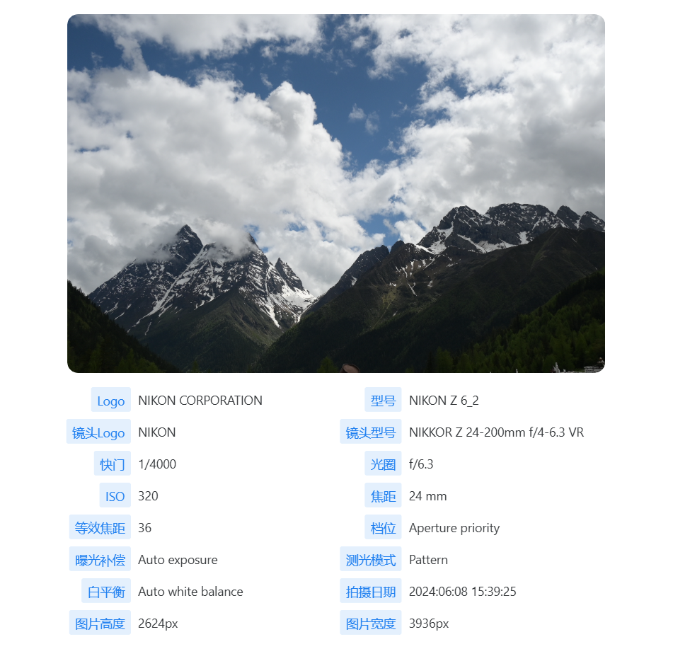
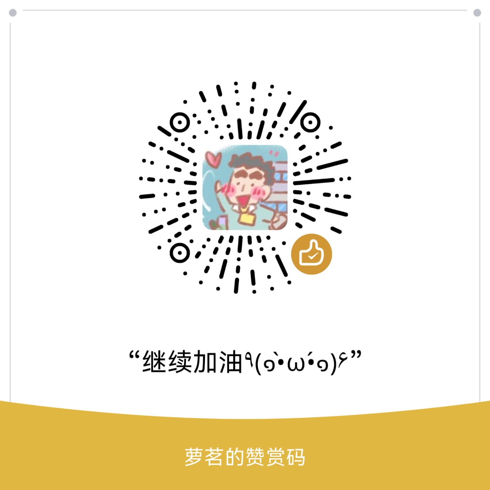

# 远山·yuanshan

> 一款快捷方便的照片添加边框/水印的可视化预览工具平台，能实现自定义样式、文案和图片。

## 功能简介

1. 自定义边框、背景、图片、文字、水印样式。
2. 自定义效果实时预览、报告生成导出、照片参数拷贝。
3. 自定义参数和模板。
4. 图片大小无限制，画质保留无压缩(可执行设置压缩百分比)。
5. 平台支持暗黑模式、恢复默认状态、文字转图片和画板等工具。
6. 项目开源任意玩。

## 效果图

### 主界面

### 主界面-暗黑主题

### 默认状态

### 纯色图片文字背景

### 自定义图片水印+边框

### 自定义图片水印上传+自定义位置

### 边框在主图内部

### 自定义边框内容位置

### 自定义图片+文字

### 自定义字体样式

### 报告生成导出

## 期望

1. 版本持续迭代，逐步优化。
2. 后续将从边框效果、对齐优化、自定义程度（圆角、内容位置、水印、输出比例、边距增益等）、预览效果便捷性等方面进一步提升。

## 结尾

> 软件开发初期，如果有不好的地方，可以在issues中/群聊中 提出您宝贵的意见 （づ￣3￣）づ╭❤～
>
> 由于相机设备有限(我只有Nikon Z6_2，目前对其他相机机型了解并不多)，适配度不是很好。如果可以，也可以向我提供一些其他相机拍摄的照片做适配 Thanks♪(･ω･)ﾉ

QQ群：暂定

## 支持一下

