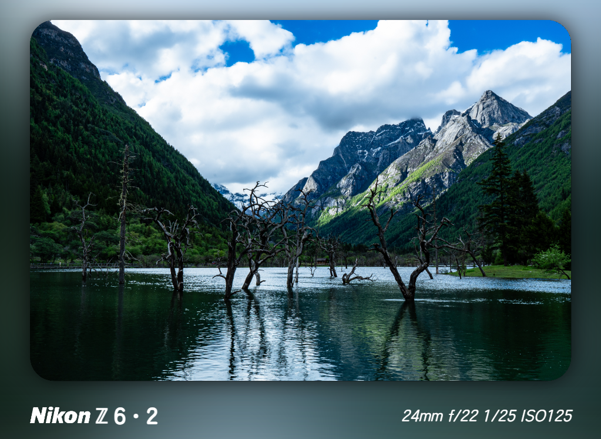
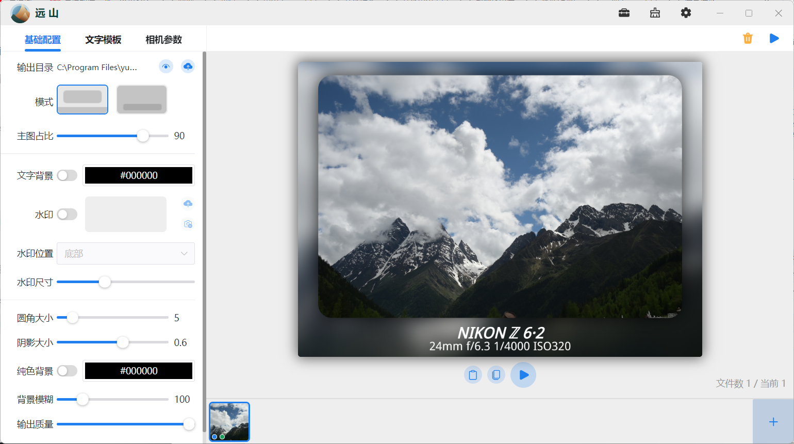
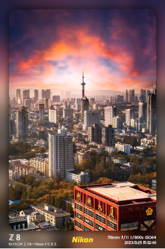
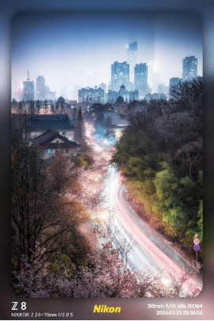
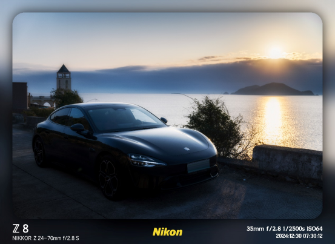
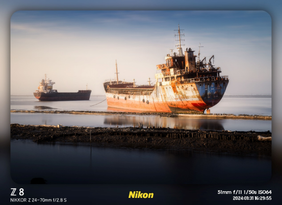

# 远山·yuanshan

> 一款快捷方便的照片添加边框/水印的可视化预览工具平台，能实现自定义样式、文案和图片。

【边框】【照片边框】【水印】【照片水印】【边框工具】【照片工具】【尼康】

## 网友投稿

- [世俗奇人投稿](contribute/ssqr.md)

## 功能简介

1. 自定义边框、背景、图片、文字、水印样式。
2. 报告生成导出、照片参数拷贝、自定义参数和模板。
3. 图片大小无限制，画质保留无压缩(可执行设置压缩百分比)。
4. 平台支持暗黑模式、恢复默认状态、文字转图片和画板等工具。
5. 安装时支持自定义安装路径。
6. **参数实时预览 [V 1.2.0]**：调整任意参数后预览自动刷新（防抖），无需再手动点击按钮。
7. **预设模板 [V 1.2.0]**：内置 6 套常用风格模板，侧边栏「模板」标签一键套用，套用后可继续微调。
8. **配置导入 / 导出 [V 1.2.0]**：将基础配置、文字模板、相机参数整合为单个 JSON 文件，便于备份、迁移与分享（导出文件与预设模板同构）。
9. **相机自带参数编辑 [V 1.2.1]**：支持自带参数的编辑/新增。
10. **预览界面可拖拽 / 缩放 [V 1.2.1]**：支持预览图的拖拽/缩放，方便查看细节。

> 完整的更新记录见 [CHANGELOG.md](./CHANGELOG.md)。

## 效果图

### 默认状态

### 纯色图片文字背景

### 自定义图片+文字

### 主界面

## 网友投稿

- [世俗奇人投稿](contribute/ssqr.md)

 

 

## 结尾

> 软件开发初期，如果有不好的地方，可以在issues中/群聊中 提出您宝贵的意见 （づ￣3￣）づ╭❤～
>
> 由于相机设备有限(我只有Nikon Z6_2，目前对其他相机机型了解并不多)，适配度不是很好。如果可以，也可以向我提供一些其他相机拍摄的照片做适配 Thanks♪(･ω･)ﾉ

QQ群：暂定

## 支持一下

